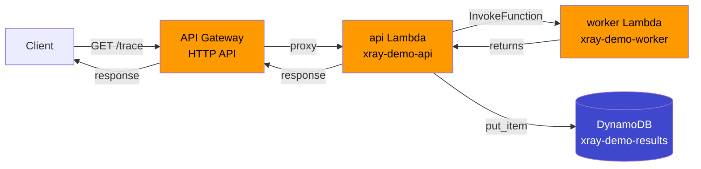
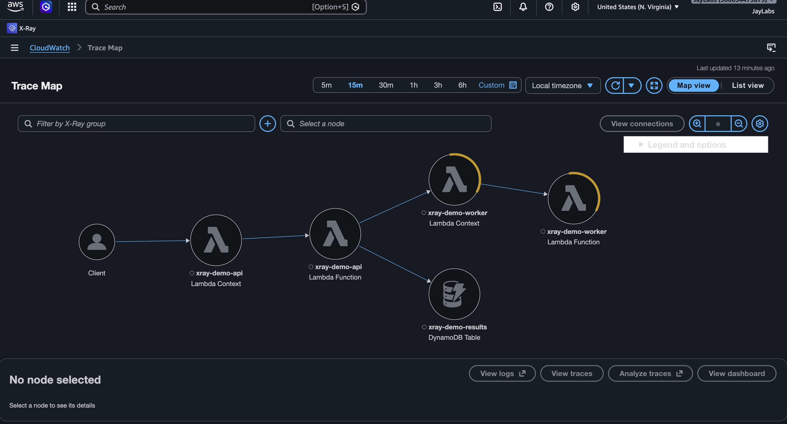
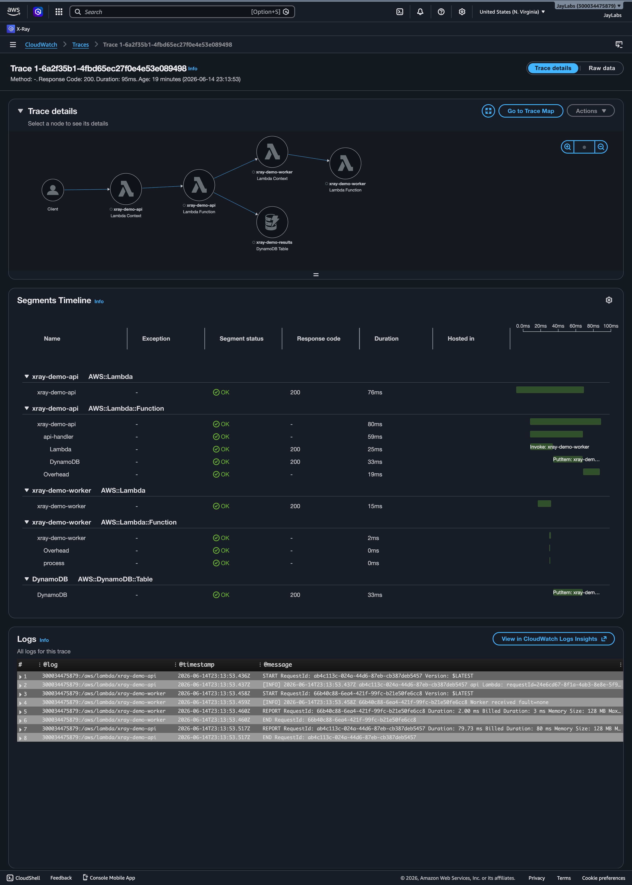
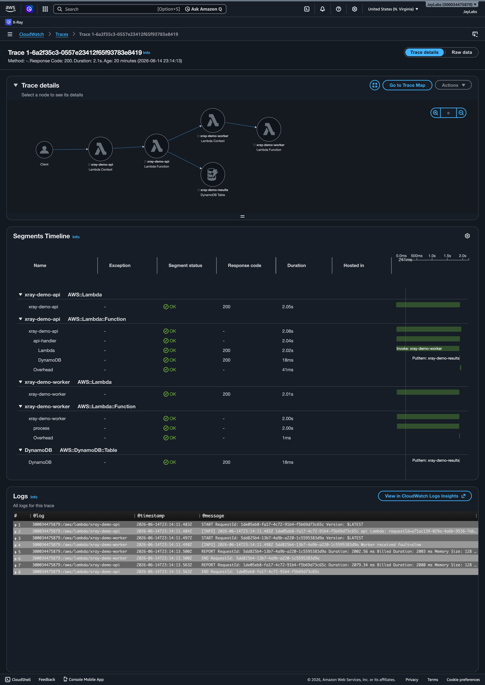
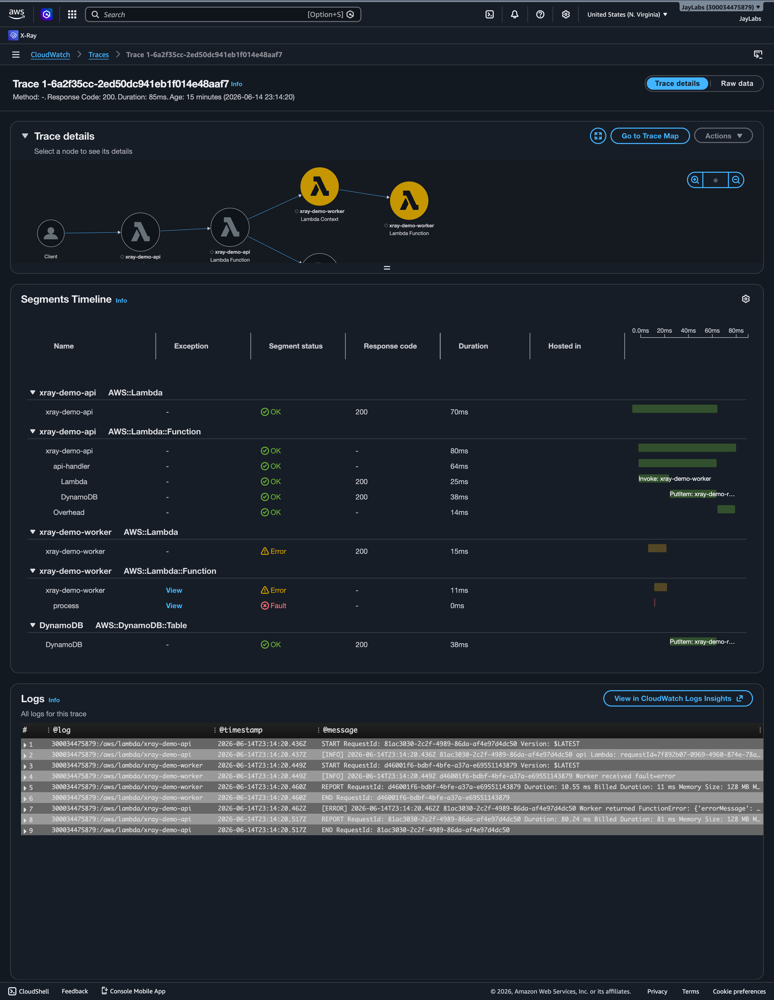

# AWS X-Ray Distributed Tracing Demo

> **Demo project** — hands-on proof-of-concept showing how to use AWS X-Ray to trace requests across two Lambda services, produce a service map, and pinpoint the root cause of injected latency and error faults. Built by Jeffrey Larbi-Akor as a QA portfolio piece. Not production code.

---

## What this is

A minimal two-service serverless app on AWS, fully instrumented with X-Ray, that demonstrates end-to-end distributed tracing for QA root-cause investigation. An HTTP API Gateway routes requests to an **api Lambda**, which calls a downstream **worker Lambda** and writes a result to DynamoDB. A fault switch (`?fault=slow` / `?fault=error`) injects controlled degradation so you can capture a healthy trace, a latency-heavy trace, and an error trace side-by-side — then use the X-Ray service map and trace timeline to localise exactly where the problem lives.

---

## Architecture



X-Ray active tracing is enabled on API Gateway and both Lambdas. `aws-xray-sdk`'s `patch_all()` wraps boto3 so the Lambda invoke and DynamoDB `put_item` calls automatically appear as child subsegments in the trace timeline.

---

## Prerequisites

| Tool | Minimum version |
|---|---|
| AWS CLI | v2 |
| AWS SAM CLI | 1.100+ |
| Python | 3.12 |
| AWS account | Free tier is sufficient |

Your IAM user needs: `AWSLambda_FullAccess`, `AmazonDynamoDBFullAccess`, `AmazonAPIGatewayAdministrator`, `AWSCloudFormationFullAccess`, `IAMFullAccess`, `AWSXRayFullAccess`.

> These are intentionally broad for a demo. A production setup would scope each down to the specific actions and resources required (e.g. `lambda:CreateFunction` on a specific ARN prefix rather than `AWSLambda_FullAccess`).

---

## Deploy

```bash
# 1. Clone
git clone https://github.com/Jeffreylarbiakor/aws-xray-tracing-demo.git
cd aws-xray-tracing-demo

# 2. Build (downloads aws-xray-sdk into each function's package)
sam build

# 3. Deploy — first time use --guided; it walks you through stack name / region
sam deploy --guided
# Recommended answers:
#   Stack Name:    xray-tracing-demo
#   AWS Region:    us-east-1
#   Confirm changeset: y
#   Save to samconfig.toml: y  (gitignored — no secrets committed)

# 4. Note the API endpoint printed in Outputs, e.g.:
#   ApiEndpoint = https://abc123.execute-api.us-east-1.amazonaws.com/trace
```

> **Cost note:** All resources are free-tier eligible at demo volumes (Lambda free tier: 1M requests/month; DynamoDB on-demand; API Gateway: 1M HTTP API calls/month). Total cost for a typical demo session ≈ $0.00. Remember to tear down when done.

---

## Generate traffic

```bash
# Replace the URL with your actual ApiEndpoint from the deploy output
python scripts/generate_traffic.py https://abc123.execute-api.us-east-1.amazonaws.com/trace

# Optional: increase requests per mode (default 5)
python scripts/generate_traffic.py <URL> --count 10
```

This sends 15 requests (5 healthy + 5 slow + 5 error). Wait ~30 seconds after it finishes before opening the X-Ray console.

You can also hit the endpoint manually:

```bash
# Healthy
curl "https://<endpoint>/trace"

# Slow (~2 s response)
curl "https://<endpoint>/trace?fault=slow"

# Error (returns HTTP 500)
curl "https://<endpoint>/trace?fault=error"
```

---

## Finding your traces in the console

After generating traffic, navigate to **CloudWatch → X-Ray → (left sidebar)**.

### 1. Service map
**CloudWatch → X-Ray → Service map**

You should see four nodes connected left-to-right:
`Client → API Gateway → xray-demo-api → xray-demo-worker`
and a DynamoDB node hanging off `xray-demo-api`.
Nodes with errors glow amber/red; hover a node to see its latency distribution.

_Service map — Client → xray-demo-api → xray-demo-worker + DynamoDB. Amber rings on the worker nodes indicate requests with injected faults._


---

### 2. Healthy trace timeline
**CloudWatch → X-Ray → Traces → filter:** `annotation.fault_mode = "none"`

Click any trace. The timeline shows:
- Top row: the full API Gateway segment (a few ms of overhead)
- Second row: the `xray-demo-api` segment — two child subsegments: **Lambda** (worker invoke) and **DynamoDB** (put_item)
- Third row: the `xray-demo-worker` segment with its **process** subsegment

Total duration: well under 500 ms. No errors.

_Healthy trace (~95ms) — all segments green, `process` subsegment completes in 0ms, no errors anywhere in the chain._


---

### 3. Slow trace timeline
**CloudWatch → X-Ray → Traces → filter:** `annotation.fault_mode = "slow"`

Click any trace. The timeline shows:
- The **Lambda** subsegment (worker invoke) spans ~2 seconds — clearly the dominant bar
- Inside the worker segment, the **process** subsegment occupies almost all of that time
- The **DynamoDB** subsegment is narrow (milliseconds), confirming the database is not the bottleneck

**Root cause is immediately visible:** the worker's `process` subsegment accounts for ~2 s out of the total ~2.1 s request duration.

_Slow trace (~2.1s) — the `process` subsegment inside xray-demo-worker spans 2.00s, accounting for nearly the entire request duration. DynamoDB (18ms) is ruled out immediately._


---

### 4. Error trace
**CloudWatch → X-Ray → Traces → filter:** `annotation.fault_mode = "error"`

Click any trace. You'll see:
- The `xray-demo-worker` segment flagged with a **fault** icon (red ✕)
- The `process` subsegment inside the worker is also marked errored
- The annotation `error = true` is visible in the segment detail panel
- The `xray-demo-api` segment returns HTTP 500, propagating the fault upward

_Error trace — the `process` subsegment inside xray-demo-worker is flagged Fault (red ✕), with the RuntimeError visible in the segment detail. The api Lambda propagates HTTP 500 upward._


---

## Root-cause walkthrough

> This section shows how the X-Ray service map and trace timeline together let you localise a fault without touching logs or guessing — the core skill being demonstrated.

**Scenario:** users report that some requests are taking 3–4× longer than normal, and a subset are failing entirely. You have no code changes to point to. Where do you look?

**Step 1 — Open the service map.**
The service map ([screenshot](docs/service-map.png)) shows the full call graph at a glance. The `xray-demo-worker` node is glowing amber (elevated latency) and `xray-demo-api` shows a small red slice (errors). This immediately tells you the degradation is in the _downstream worker_, not in API Gateway or DynamoDB.

**Step 2 — Filter traces by the slow path.**
In the Traces view, filter by `annotation.fault_mode = "slow"` (in a real scenario you'd filter by duration or error rate). Opening one of the slow traces ([screenshot](docs/trace-slow.png)) shows the timeline: the `Lambda` subsegment that represents the worker invoke is the widest bar — ~2 s out of ~2.1 s total. Drilling into the worker segment reveals that the `process` subsegment holds the entire 2 s. The DynamoDB subsegment is narrow, ruling it out.

**Conclusion:** the bottleneck is inside `worker.handler.lambda_handler`, in the code block labelled `process`. In this demo that's the injected `time.sleep(2)`. In a real system this would point you to the exact function and line to investigate.

**Step 3 — Confirm the error path.**
Switching the filter to the error traces ([screenshot](docs/trace-error.png)), the worker segment shows a fault icon and the `error = true` annotation. The exception type (`RuntimeError: Injected fault`) is visible in the segment detail. This tells you exactly which service threw and what it raised — without needing to search CloudWatch Logs.

**Key takeaway:** X-Ray compressed a multi-service debugging problem (which service? which call within it?) into a two-click investigation — service map for topology, trace timeline for root cause.

---

## Teardown

```bash
sam delete --stack-name xray-tracing-demo
# Confirm: y
# This removes all Lambda functions, the DynamoDB table, API Gateway, IAM roles,
# and the CloudWatch log groups created by SAM. Nothing billable is left behind.
```

